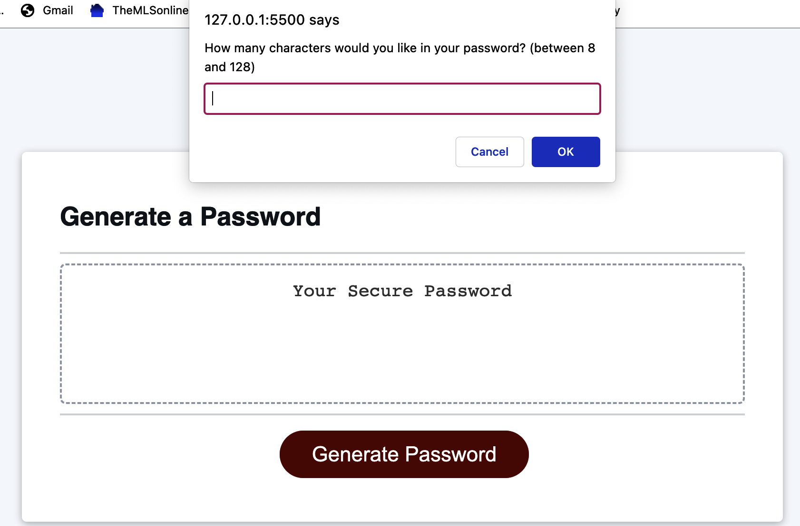
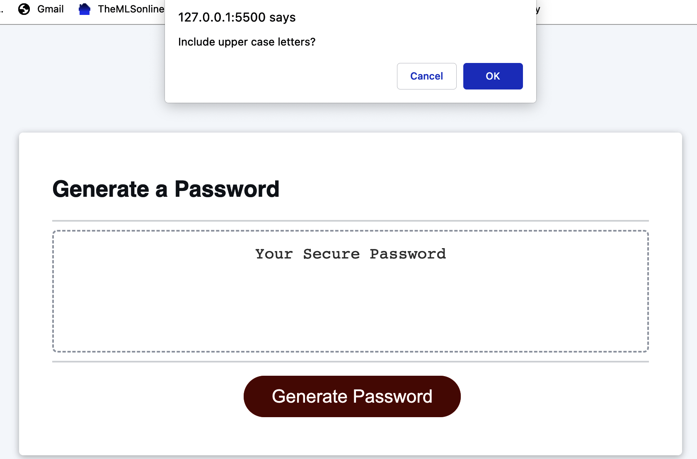
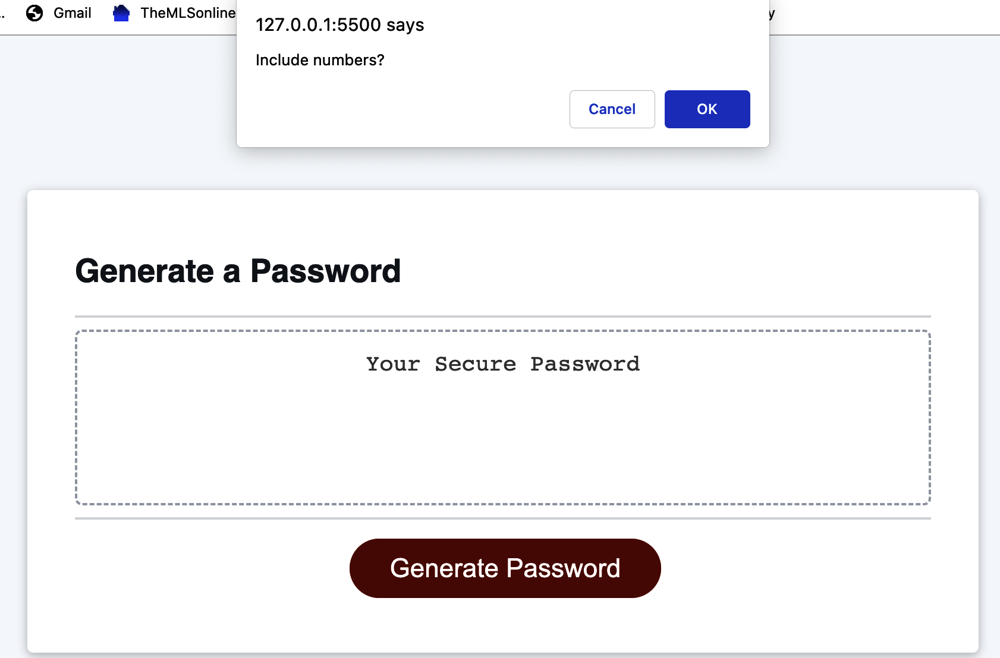
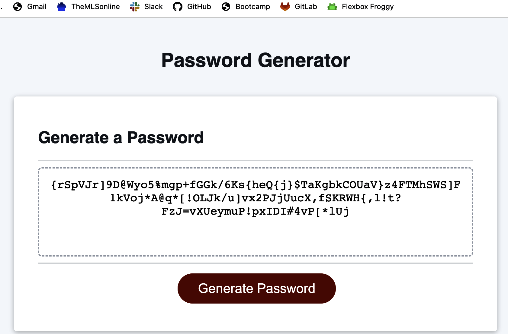

# <Secure-Password-Generator>

## Description

In this project I reconfigured the code to include such questions for a secure password to include lowercase letters, uppercase letters, numeric symbols, and special characters. Once the user answers the questions, a new secure password will be displayed within the box.

[Link to deployed application](https://saraschroeder.github.io/Password-Generator/)

## Installation

N/A

## Usage

In order to run my project you must select "Generate Password" then follow through the prompt. It will then ask you whether you want to include uppercase letters, lowercase letters, numbers, or special characters. Once you've answered all the questions it will then generate your new secure password.

## Credits

N/A

## License

[MIT](https://choosealicense.com/licenses/mit/)# Password-Generator
